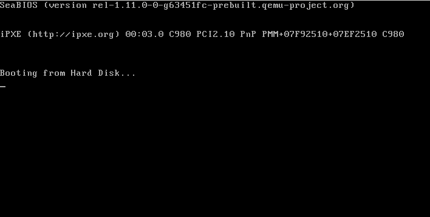
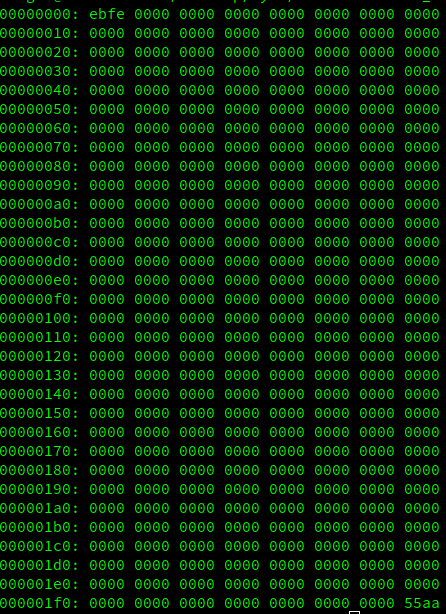

# Barebones 

Before we meet with out operating system, BIOS performs hardware initializations first. More info about [BIOS](https://en.wikipedia.org/wiki/BIOS) 

## I'm the first

If a BIOS wants to load an operating system, it should know from the boot sector how to perform. Where is the boot loader? It should be absolutely knowable so the first sector(512B) is a good place. What does a valid sector look like? It should filled the 511 and 512 bytes with `0xAA55`.

## Compile boot sector

Here's the code:

    ; Infinite loop (e9 fd ff)
    loop:
        jmp loop 
    
    ; Fill with 510 zeros minus the size of the previous code
    times 510-($-$$) db 0
    ; Magic number
    dw 0xaa55 

Compile command: `nasm -f bin boot_sect_simple.asm -o boot_sect_simple.bin`

Run command : `qemu boot_sect_simple.bin` or `qemu-system-x86_64 boot_sect_simple.bin`

You will see:

## Want to see binary form of file

command line `xxd file` will help you.

